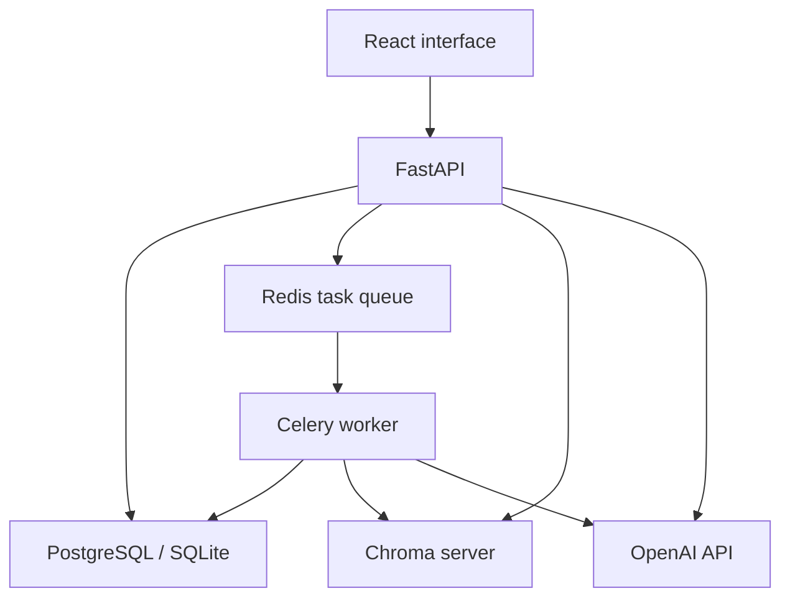

# Meridian

Meridian is a full-stack application for document search, structured extraction,
and lead qualification. It combines a React interface with a FastAPI backend.

**Repository history:** Meridian was developed before this GitHub repository was
created. It was published here later, so the public commit history begins with the
repository import rather than the project's original development timeline.

- **Knowledge Base:** upload PDF, DOCX, TXT, or Markdown files and ask questions
  using retrieved excerpts. Answers include source references.
- **Document Intelligence:** extract invoice, contract, or receipt fields into
  validated JSON.
- **Leads:** store contacts, generate a qualification score and explanation,
  draft an outreach email, and update a lead's status manually.

The project demonstrates authentication, ownership checks, background jobs,
token-based chunking, vector retrieval, schema validation, database migrations,
and integration tests. AI output requires human review; citations and model
confidence scores do not establish factual accuracy.

## Architecture



Uploads return `202` with `pending` status. The worker extracts text, creates
chunks and embeddings, and records `ready` or `failed`; the interface polls for
completion. Questions, structured extraction, and lead qualification are
synchronous requests. See [ARCHITECTURE.md](ARCHITECTURE.md) for the data model,
failure behavior, and design limitations.

## Requirements

- Python 3.12 and Node.js 22.12+ for local development.
- Redis and a Chroma server for separate API/worker processes.
- An OpenAI API key with access to the configured chat and embedding models.
- Docker with Compose v2 for the container workflow; Make is optional.

## Run with Docker Compose

From the repository root:

```bash
cp .env.example .env
# Set SECRET_KEY and OPENAI_API_KEY; check the model settings for your account.
docker compose up --build
```

Generate a signing key with:

```bash
python3 -c "import secrets; print(secrets.token_hex(32))"
```

- Frontend: http://localhost:5173
- API documentation: http://localhost:8000/docs
- Liveness: http://localhost:8000/health
- Database readiness: http://localhost:8000/health/ready

Compose provides PostgreSQL, Redis, Chroma, the API, the worker, and the web
interface. Uploaded files, database records, and vectors use named volumes.
Redis queue data is not persisted across container replacement. The supplied
configuration is for a local demo, not an internet-facing production deployment.

## Run locally

These examples use a POSIX shell; on Windows, WSL can run the same commands.
From the repository root:

```bash
cd backend
python3 -m venv .venv
source .venv/bin/activate
pip install -r requirements-dev.txt
cp .env.example .env
# Set SECRET_KEY, OPENAI_API_KEY, and models available to your API account.
alembic upgrade head
uvicorn main:app --reload
```

In separate terminals, activate the same environment and run the following from
`backend/`:

```bash
redis-server
```

```bash
chroma run --path ./chroma_db --host 127.0.0.1 --port 8001
```

```bash
celery -A worker.celery_app worker --loglevel=info
```

The example environment sets `CHROMA_HOST=localhost` and `CHROMA_PORT=8001`.
An embedded Chroma client is retained for single-process tests when
`CHROMA_HOST` is unset. Do not share an embedded store between the API and worker:
their in-memory vector indexes can diverge.

Start the frontend from the repository root:

```bash
cd frontend
npm ci
cp .env.example .env
npm run dev
```

Register an account, upload a small text document, wait for `ready`, and ask a
question about its contents. Extraction accepts only ready documents. Without a
worker, uploaded documents remain pending; a broker enqueue failure returns
`503` and attempts to remove the new document and file.

## Verification

From `backend/`, with its virtual environment active:

```bash
ruff check .
pytest --cov --cov-report=term-missing
```

From `frontend/`:

```bash
npm run lint
npm run build
```

The tests use SQLite, embedded Chroma, eager Celery tasks, and mocked OpenAI
responses. They test application behavior without making paid AI requests.
The fixture falls back to a simple tokenizer if tiktoken's encoding download is
unavailable; that fallback checks chunking logic, not actual BPE token counts.
CI runs backend tests/lint, a backend Docker build, and frontend lint/build.

## Configuration and limitations

Backend settings are documented in `backend/.env.example`. Docker Compose reads
its configuration from the root `.env`; the frontend API URL is a build-time
setting in Compose and `frontend/.env` in local development.

- `ENVIRONMENT=production` rejects a weak signing key, a blank/placeholder API
  key, and wildcard CORS. These checks alone do not establish production readiness.
- Set `CHAT_MODEL`, `FAST_MODEL`, and `EMBEDDING_MODEL` to models available to your
  API account. Chat calls use Chat Completions, `temperature`, and `max_tokens`;
  extraction and qualification additionally require JSON-object output support.
  CI uses mocked OpenAI responses; live behavior depends on the configured API
  account and model availability.
- SQLite is intended for development. Existing databases require Alembic migrations
  for schema changes; automatic table creation at startup does not migrate a schema.
- Document storage, vectors, database commits, and queue publication do not form
  one atomic transaction. Cleanup covers common failures, but crashes and concurrent
  operations may still require manual recovery. Chroma cleanup is best effort.
- PDFs need a text layer; OCR is not implemented. DOCX extraction reads paragraphs,
  not tables, headers, or footers. Large documents may exceed model context limits.
- The interface shows the first 20 documents and 50 leads per filter; it does not
  expose the API's pagination controls. The layout is primarily for desktop use.
- Each account owns its own data. Roles are stored, but there is no team-sharing
  or complete role-permission system. JWTs are kept in browser local storage;
  password reset and refresh-token workflows are not implemented.
- AI scores and drafts are suggestions; no email is sent by the application.
  Dependency security review and internet-facing deployment hardening are outside
  the current scope.
